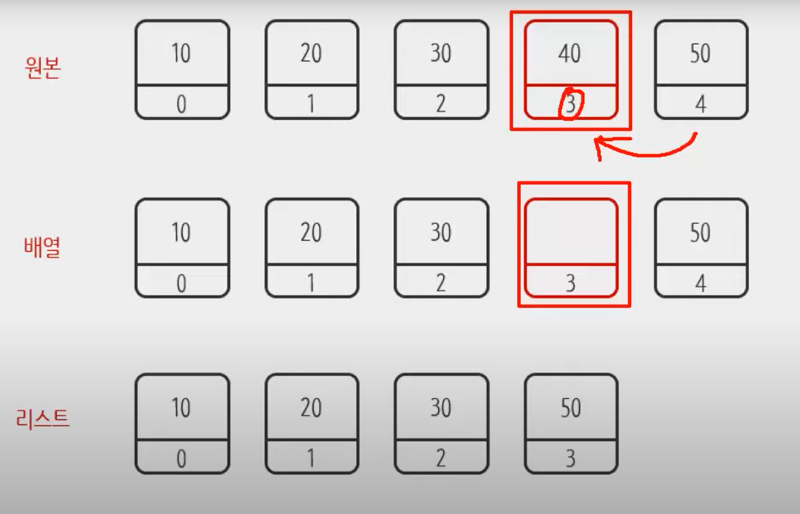

# List 개념 정리

- 순서 , 중복저장 허용

### Array vs List

- 비슷하다
    - Array도 순서대로 저장 , 중복저장 가능
    - Array가 가진 기능보다 리스트가 좀 더 많다.
    - 사용방법의 차이
        - Array 는 인덱스가 중요하다. 인덱스를 가지고 바로 찾아갈 수 있다.
        - List의 경우에는 내부적인 인덱스를 가지고 있지만 , 더 중요한 것이 데이터가 저장되어있는 순서가 훨씬 더 중요하게 여겨지는 데이터 타입

- 추가
    - Array

      인덱스 3번에 데이터를 추가할 경우 기존 데이터를 대체한다. ( 덮여 쓰기 )

    - List

      인덱스 3번에 데이터를 추가한 경우 기존 데이터는 인덱스가 추가되어서 뒤로 밀려난다.

- 삭제
    - Array

      인덱스 3번에 데이털 삭제했을 경우 비어있는 상태를 유지

        - 데이터 유무를 체크해야 한다. , 빈공간이 사라지지 않기 때문에 메모리를 더 차지

        - 장점 : 인덱스 값은 변경되지 않기에 바로 찾을 수 있다.
    - List

      3번 데이터가 사라지고 3번 데이터 뒤에 있는 데이터가 전진

        - 데이터가 연속되어 있다. , 데이터를 순회할 떄 데이터의 유무를 체크할 필요가 없다.

      

    - 리스트에서 인덱스는 몇번째 데이터인가 정도의 정보
    - 배열에서 인덱스는 값에 대한 유일무이한 식별자

### 리스트 기능

- 자료구조의 중요한 점은 어떤 기능이 있고 어떻게 동작하는지가 중요 ( 동작방법과 기능 ) ⇒ `Operation`

- 처음, 끝 , 중간에 엘리먼트를 추가/삭제하는 기능
- 리스트에 데이터가 있는지를 체크하는 기능
- 리스트의 모든 데이터에 접근할 수 있는 기능